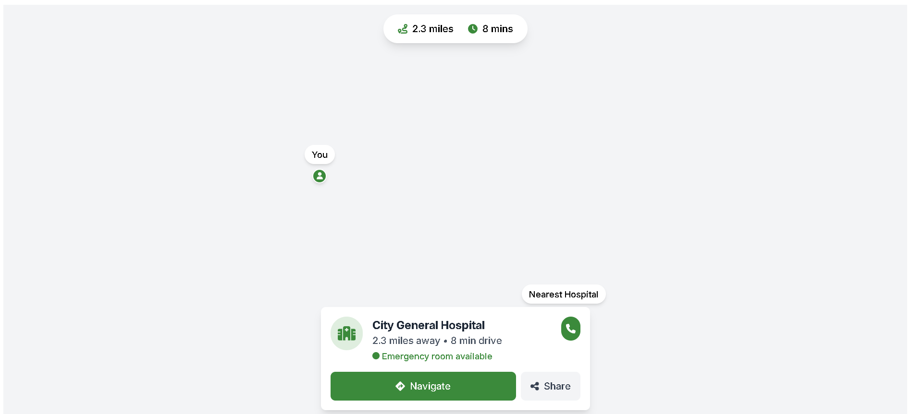
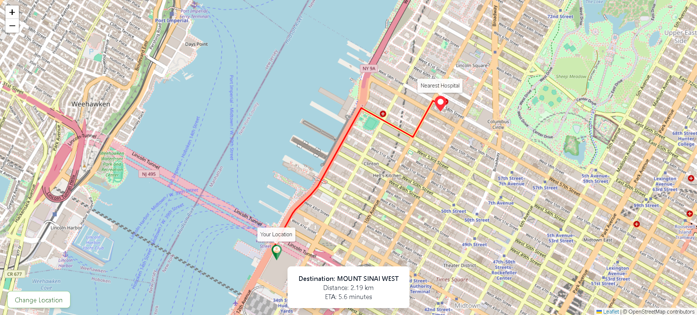

# 🩺 UrgentRoute — Frontend

UrgentRoute is a fast, map-based emergency web app that helps users find the nearest hospital in the U.S. based on real-time location or manual selection. It’s designed for speed, accessibility, and responsiveness — ideal for use in high-stress situations.

> **Live App:** [https://mahros-alqabasy.github.io/urgent-way](https://mahros-alqabasy.github.io/urgent-way)

---

## 📷 Screenshots

### Landing Page


### Location Selection



### Route View



---

## Features

- GPS-based or map-click location selection
- KD-Tree powered nearest hospital lookup
- Real driving route from OpenRouteService
- Fully responsive (mobile and desktop)
- No login, privacy-first
- Clean and emergency-optimized UI

---

## Built With

- **React + Vite** — lightweight and fast dev stack
- **Tailwind CSS** — fully customized healing-themed design
- **React Leaflet + OpenStreetMap** — map interactions
- **Axios** — API communication
- **Heroicons** — professional iconography
- **Framer Motion** — UI animation (optional)

---

## 🛠 Setup & Development

```bash
git clone https://github.com/mahros-alqabasy/urgent-way.git
cd urgent-way
npm install
npm run dev
```

Runs on: `http://localhost:5173`

---

## 🚀 Deployment (GitHub Pages)

1. Set the correct `base` in `vite.config.js`:

```js
base: '/urgent-way/',
```

2. Deploy using:

```bash
npm run build
npm run deploy
```

> Uses `gh-pages` branch via `npm run deploy`.

---

## 📁 Folder Structure

```
src/
├── api/              # API wrapper (axios-based)
├── components/       # Navbar, shared elements
├── pages/            # Landing, Home, MapView, ChooseLocation
├── config.js         # API base URL config
└── assets/           # (optional) icons/images
```

---

## 🔌 API Integration

FastAPI backend hosted on Railway:

- `/nearest-hospital` (GET)
- `/route` (POST)

See [UrgentRoute API Repo](https://github.com/mahros-alqabasy/urgentroute-api)

---

## 📃 License

MIT License © 2025 [@mahros-alqabasy](https://github.com/mahros-alqabasy)
